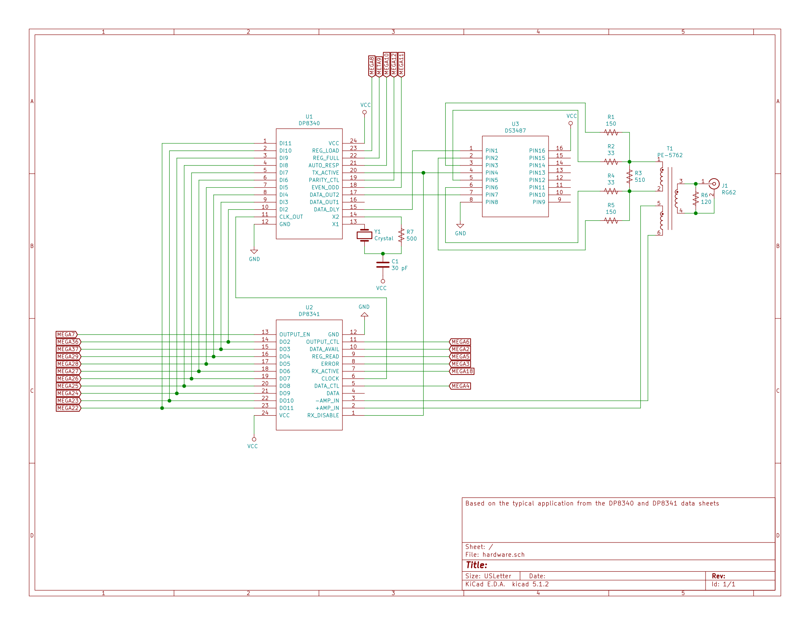

# interface1

A serial attached Arduino interface using the National Semiconductor DP8340 and DP8341.

## Schematic

## Bill of Materials

This interface requires an [Arduino Mega 2560 R3](https://store.arduino.cc/usa/mega-2560-r3).

 Item | Quantity | Description                   | Reference  | Part Number                   | Source
:----:|---------:|-------------------------------|------------|-------------------------------|----------------
1     | 1        | IBM 3270 Protocol Transmitter | U1         | National Semiconductor DP8340 | Obsolete - eBay
2     | 1        | IBM 3270 Protocol Receiver    | U2         | National Semiconductor DP8341 | Obsolete - eBay
3     | 1        | Quad RS-422 Line Driver       | U3         | Texas Instruments DS3487      | Obsolete - eBay
4     | 1        | Pulse Transformer - 1:1:1     | T1         | Pulse PE-5762                 | Obsolete - eBay
5     | 1        | Crystal - 18.867 MHz          | Y1         | IQD LFXTAL057125 *            | [Mouser](https://www.mouser.com/ProductDetail/IQD/LFXTAL057125Bulk?qs=%2Fha2pyFaduieSzBxw7UAJRZlCXjBZuIKPyofrMyYW7wVunrhuBMeiQd4MCF50LLz)
6     | 2        | Resistor - 33 ohm             | R2, R4     |                               | [Mouser](https://www.mouser.com/ProductDetail/Xicon/271-33-RC?qs=sGAEpiMZZMu61qfTUdNhGzoeXLT9qgk%252BV159XfY8c4Q%3D)
7     | 1        | Resistor - 120 ohm            | R6         |                               | [Mouser](https://www.mouser.com/ProductDetail/Xicon/271-120-RC?qs=sGAEpiMZZMu61qfTUdNhG7Of23Pr6gu8rRE5UXBJoDw%3D)
8     | 2        | Resistor - 150 ohm            | R1, R5     |                               | [Mouser](https://www.mouser.com/ProductDetail/Xicon/271-150-RC?qs=sGAEpiMZZMu61qfTUdNhG2ZzrN2CiS9nBcPQNrtAXYk%3D)
9     | 1        | Resistor - 500 ohm            | R7         |                               | [Mouser](https://www.mouser.com/ProductDetail/Xicon/271-499-RC?qs=sGAEpiMZZMu61qfTUdNhG6lpw21m8SOsvE2iEnaSg1s%3D)
10    | 1        | Resistor - 510 ohm            | R3         |                               | [Mouser](https://www.mouser.com/ProductDetail/Xicon/271-510-RC?qs=sGAEpiMZZMu61qfTUdNhG9RrhBeDi8B8FBVTnOgGHiw%3D)
11    | 1        | Capacitor - 30 pF             | C1         |                               | [Mouser](https://www.mouser.com/ProductDetail/Vishay-Cera-Mite/561R10TCCQ30?qs=sGAEpiMZZMt1mVBmZSXTPNbSVgF1iSv4q4pBhPBLwuM%3D)
12    | 3        | Capacitor - 0.1 uF            | C2, C3, C4 |                               | [Mouser](https://www.mouser.com/ProductDetail/Vishay-BC-Components/K104K15X7RF53L2?qs=%2Fha2pyFadujZBSsyKhN2cCnGMY0oYMxsnapy5diPgBuVoINU4ePXMg%3D%3D)
13    | 1        | BNC Jack                      | J1         |                               | [Mouser](https://www.mouser.com/ProductDetail/TE-Connectivity/5227161-3?qs=%2Fha2pyFaduiGA%252Bh8aDcjGvgxten7RGi%2FL59ZMwKXDjte07aSAL7vPw%3D%3D)

\* - SMD

## Firmware

The firmware currently provides the ability to send commands and receive responses - it is designed to implement a terminal controller, not a terminal.
