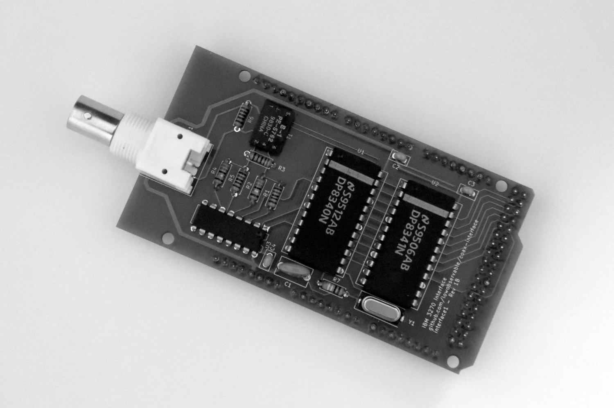

# interface1

Legacy interface using obsolete National Semiconductor DP8340 and DP8341.



This project uses several obsolete components; you may be able to find these as _new old stock_. See [interface2](../interface2) for a modern alternative using a Lattice iCE40 FPGA and STM32 microcontroller.

## Hardware

This interface requires an [Arduino Mega 2560 R3](https://store.arduino.cc/usa/mega-2560-r3).

You can find a [complete BOM](https://octopart.com/bom-tool/SZ3rSPgD) on Octopart. I have purchased all current components from Mouser and obsolete ones from eBay.

You can find the Gerber files for fabricating a PCB in the [fabrication](hardware/fabrication) directory. I have used JLCPCB to make the PCBs.

## Firmware

The firmware currently provides the ability to send commands and receive responses - it is designed to implement a terminal controller, not a terminal.

You will need [PlatformIO](https://platformio.org/) to build and upload the firmware, only Platform IO Core (the CLI) is required.

To build and upload the firmware for an Arduino Mega 2560 R3:

```
platformio run -t upload -e mega2560
```

For an original Arduino Mega:

```
platformio run -t upload -e mega1280
```
