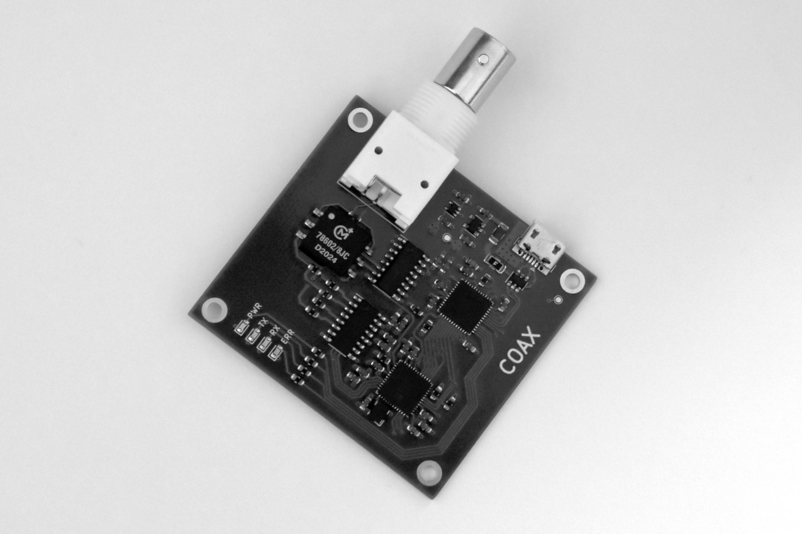

# interface2

Modern interface using a Lattice iCE40 FPGA and STM32 microcontroller.



## Hardware

You can find a [complete BOM](https://octopart.com/bom-tool/S80JaI18) on Octopart.

You can find the Gerber files for fabricating a PCB in the [fabrication](pcb/fabrication) directory. I have used JLCPCB to make the PCBs.

## FPGA

For now, the FPGA bitstream must be built using Lattice iCEcube2.

```
cd fpga
make
```

Uses FIFO module from [Sylvain Munaut](https://github.com/smunaut).

## Firmware

The firmware currently provides the ability to send commands and receive responses - it is designed to implement a terminal controller, not a terminal.

You will need [PlatformIO](https://platformio.org/) to build and upload the firmware, only Platform IO Core (the CLI) is required.

Before building the firmware, you will need to generate the FPGA bitstream; see the steps above.

To build and upload the firmware using USB DFU:

```
cd firmware
platformio run -t upload
```
