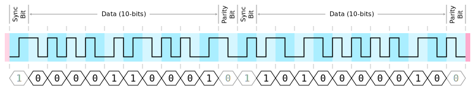
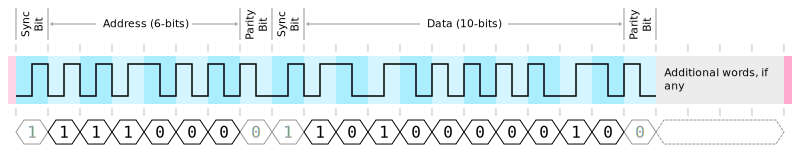
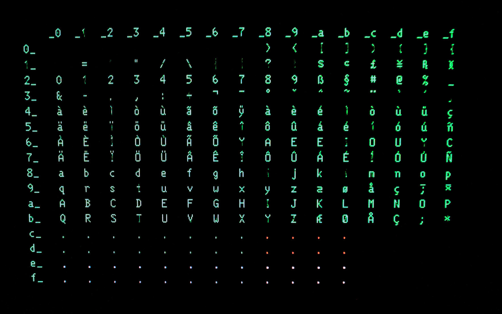
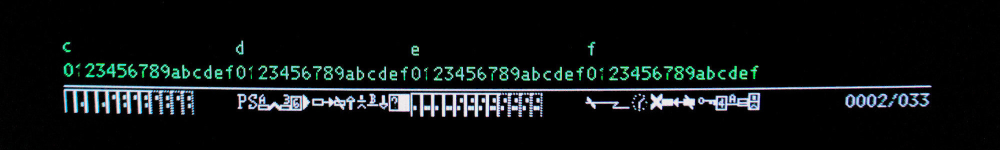

# IBM 3270 Protocol

This document describes the protocol used to communicate between
[IBM 3270](https://en.m.wikipedia.org/wiki/IBM_3270)
type terminals and IBM 3174 and 3274 controllers.

If you are looking for information on the 3270 data stream (as used by TN3270)
I'd recommend the following resources:

  * IBM [3270 Data Stream Programmer's Reference](https://bitsavers.computerhistory.org/pdf/ibm/3270/GA23-0059-4_3270_Data_Stream_Programmers_Reference_Dec88.pdf) (GA23-0059-4)
  * Greg Price's [3270 Programming Overview](http://www.prycroft6.com.au/misc/3270.html)
  * Tommy Sprinkles' [3270 Data Stream Programming](https://www.tommysprinkle.com/mvs/P3270/start.htm)

For background to the IBM 3270 type terminals and why I am documenting the
protocol, see
_[Building an IBM 3270 terminal controller](https://ajk.me/building-an-ibm-3270-terminal-controller)_.

This document is a work in progress - I appreciate any
[feedback, corrections, or contributions](mailto:projects+3270@ajk.me).

## Devices

The 3270 family consists of the following devices:

  * Controller
  * Multiplexer
  * Display Station - CUT and DFT type terminals
  * Printer

## Physical Layer

Devices are connected point-to-point by RG-62 coaxial cable with a
characteristic impedance of 93 Ω. Converters and baluns can convert the coaxial
cable to other media:

  * Twisted pair
  * Optical fiber
  * IBM Cabling System

Differential signaling is used with the coax shield acting as a return.

## Data Link Layer

Data is sent at a bit rate of 2.3587 Mb/s in serial fashion using Machester
encoding. Frames begin and end with unique start and end sequences, both
contain a deliberate violation of the Manchester encoding scheme.

A frame contains one or more 10-bit words. Each 10-bit word within a frame
starts with a sync bit and ends with an even parity bit - the parity
calculation includes the sync bit. Words are transmitted most significant bit
(MSB) first.

### 3299 Variant

The 3299 variant of the protocol includes a 6-bit address word at the start
of each frame, specifying the multiplexer port the remainder of the frame
should be sent to.

As with 10-bit words, the 6-bit address word starts with a sync bit and ends
with an even parity bit.

### Words

All communication is initiated by the controller when it sends a frame
containing a command word and optional data words. The attached device responds
with a frame containing one or more data words.

Except for the `POLL` command response, words are either:

  * Command - encapsulates a single 8-bit command byte, sent from a controller
    to an attached device
  * Data - encapsulates a single 8-bit data byte
  * Transmission Turnaround (TT/AR) - sent as an acknowledgment of a command
    when there is no response data

| Bit                     |  9  |  8  |  7  |  6  |  5  |  4  |  3  |  2  |  1  |  0  |
| ----------------------- |:---:|:---:|:---:|:---:|:---:|:---:|:---:|:---:|:---:|:---:|
| Command                 | _C_ | _C_ | _C_ | _C_ | _C_ | _C_ | _C_ | _C_ | `0` | `1` |
| Data                    | _D_ | _D_ | _D_ | _D_ | _D_ | _D_ | _D_ | _D_ | _P_ | `0` |
| Transmission Turnaround | `0` | `0` | `0` | `0` | `0` | `0` | `0` | `0` | `0` | `0` |

Later devices populate an additional odd parity bit in position 1 (`P`) of
data words; earlier devices leave this `0`.

See the `POLL` command section for a description of the `POLL` response words.

## CUT Terminals

Control Unit Terminal (CUT) type terminals depend on the controller to handle
the 3270 data stream. The controller converts the 3270 data stream commands,
orders, and attributes to commands and data recognized by the terminal.
Distributed Function Terminal (DFT) type terminals, unlike the CUT type, can
handle the 3270 data stream natively.

A CUT type terminal consists of the following components considered part of the
base feature:

  * Display
  * Keyboard
  * Registers

Optional features include an Extended Attribute Buffer (EAB), a selector pen,
and a magnetic stripe reader.

### Display

The display contents, including the status line, are stored in the regen
buffer - named because it is used to regenerate the displayed image.

The size of the buffer depends on the model:

| Model | Rows | Columns | Buffer Size |
|-------|-----:|--------:|------------:|
| 2     |   24 |      80 |        2000 |
| 3     |   32 |      80 |        2640 |
| 4     |   43 |      80 |        3520 |
| 5     |   27 |     132 |        3696 |

_The row count above does not include the status line row, the buffer size does
include the status line._

Each byte in the regen buffer represents a cell on the display - the byte may
be a character or an attribute byte. Attribute bytes control the formatting of
subsequent cells and appear as a blank cell.

The following operations can be performed on the regen buffer:

  * Read
  * Write - overwrite and insert
  * Search
  * Clear

The address counter register controls the starting location for these
operations - and also the cursor location. Addresses start at `0`, which
represents the start of the status line. The top-left cell address is equal to
the display width, `80` in the case of 80-column mode.

#### Character Encoding

The character encoding used to represent characters is unique to 3270
terminals; it is not EBCDIC or ASCII. Values below `0xc0` represent displayable
characters.

#### Attribute Bytes

Attribute bytes control the formatting and capabilities of the characters that
follow and store state, such as the modified bit (indicating that the following
field has been modified). The attribute byte formatting wraps-around at the end
of the regen buffer, meaning an attribute byte in the last regen buffer cell
controls the formatting of characters beginning in the top-left cell.

| Bit |  7  |  6  |  5  |  4  |  3  |  2  |  1  |  0  |
| --- |:---:|:---:|:---:|:---:|:---:|:---:|:---:|:---:|
|     | `1` | `1` | _P_ | _N_ | _D_ | _D_ | `0` | _M_ |

Bits that control the formatting:

| Bits      | Description                                        |
| --------- | -------------------------------------------------- |
| 5 (`P`)   | `0` - unprotected `1` - protected                                    |
| 3-2 (`D`) | `00` - normal, not detectable by selector pen `01` - normal, detectable by selector pen `10` - intense, detectable by selector pen `11` - hidden, not detectable by selector pen |

Bits that store state:

| Bits      | Description                                        |
| --------- | -------------------------------------------------- |
| 4 (`N`)   | `0` - alphanumeric `1` - numeric                |
| 0 (`M`)   | `0` - unmodified `1` - modified by the operator |

An attribute byte appears as a blank cell on the display. Because the attribute
byte takes up space on the display this imposes limitations on screen design.

#### Status Line

The status line is shown at the bottom of the display. During normal operation,
the status line is managed by the controller, except for the cursor location
area (displayed on the right). The status line begins at address `0`.

The status line does not support formatting. The space in the character
encoding used for attribute bytes (`0xc0` and above) is used to represent
symbols that are unique to the status line.

#### Extended Attribute Buffer (EAB)

The Extended Attribute Buffer (EAB) is an optional feature introduced with the
IBM 3279 terminal that provides more advanced formatting capabilities. It is
implemented as a second buffer that shadows the regen buffer; this buffer only
contains extended attribute bytes that control the formatting of the characters
in the regen buffer - it does not include any characters.

An extended attribute byte is considered an Extended Field Attribute (EFA) if
the byte shadows an attribute byte in the regen buffer, or an Extended
Character Attribute (ECA) if it shadows a character byte.

| Bit |  7  |  6  |  5  |  4  |  3  |  2  |  1  |  0  |
| --- |:---:|:---:|:---:|:---:|:---:|:---:|:---:|:---:|
|     | _M_ | _M_ | _C_ | _C_ | _C_ | _S_ | _S_ | _S_ |

Bits:

| Bits      | Description |
| --------- | ----------- |
| 7-6 (`M`) | `00` - normal (or most recent EFA) `01` - blink `10` - reverse `11` - underline |
| 5-3 (`C`) | `000` - base color (or most recent EFA) `001` - blue `010` - red `011` - pink `100` - green `101` - turquoise `110` - yellow `111` - white |
| 2-0 (`S`) | `000` - base (or most recent EFA) `001` - APL `010` - PS 2 `011` - PS 3 `100` - PS 4 `101` - PS 5 `110` - PS 6 `111` - PS 7 |

### Keyboard

Keypresses are stored in a FIFO buffer. If there are any keypresses, the scan
code of the first keypress is returned in response to a `POLL` command.

Modifier keys such as _shift_ or _alt_ are treated as regular keypresses but
trigger a keypress on key down and key up (releasing the key). Depending on the
terminal model, the terminal may insert a synthetic release keypress (a unique
scan code) before the modifier scan code when a modifier key is released. 

### Registers

Aside from the display and keyboard buffers, the terminal has the following
registers:

  * Terminal ID
  * Extended ID
  * Status
  * Address Counter - 16-bit address split into 8-bit high and low registers
  * Control
  * Secondary Control
  * Mask
  * Keyboard Clicker State

Registers can be read-only, write-only, or read-write.

### Features

### Commands

| Feature | Command | 9 | 8 | 7 | 6 | 5 | 4 | 3 | 2 | 1 | 0 |
| ------- | ------- |:-:|:-:|:-:|:-:|:-:|:-:|:-:|:-:|:-:|:-:|
| Base | `POLL` | _X_ | _X_ | `0` | `0` | `0` | `0` | `0` | `1` | `0` | `1` |
| Base | `POLL_ACK` | `0` | `0` | `0` | `1` | `0` | `0` | `0` | `1` | `0` | `1` |
| Base | `READ_STATUS` | `0` | `0` | `0` | `0` | `1` | `1` | `0` | `1` | `0` | `1` |
| Base | `READ_TERMINAL_ID` | `0` | `0` | `0` | `0` | `1` | `0` | `0` | `1` | `0` | `1` |
| Base | `READ_EXTENDED_ID` | `0` | `0` | `0` | `0` | `0` | `1` | `1` | `1` | `0` | `1` |
| Base | `READ_ADDRESS_COUNTER_HI` | `0` | `0` | `0` | `0` | `0` | `1` | `0` | `1` | `0` | `1` |
| Base | `READ_ADDRESS_COUNTER_LO` | `0` | `0` | `0` | `1` | `0` | `1` | `0` | `1` | `0` | `1` |
| Base | `READ_DATA` | `0` | `0` | `0` | `0` | `0` | `0` | `1` | `1` | `0` | `1` |
| Base | `READ_MULTIPLE` | `0` | `0` | `0` | `0` | `1` | `0` | `1` | `1` | `0` | `1` |
| Base | `RESET` | `0` | `0` | `0` | `0` | `0` | `0` | `1` | `0` | `0` | `1` |
| Base | `LOAD_CONTROL_REGISTER` | `0` | `0` | `0` | `0` | `1` | `0` | `1` | `0` | `0` | `1` |
| Base | `LOAD_SECONDARY_CONTROL` | `0` | `0` | `0` | `1` | `1` | `0` | `1` | `0` | `0` | `1` |
| Base | `LOAD_MASK` | `0` | `0` | `0` | `1` | `0` | `1` | `1` | `0` | `0` | `1` |
| Base | `LOAD_ADDRESS_COUNTER_HI` | `0` | `0` | `0` | `0` | `0` | `1` | `0` | `0` | `0` | `1` |
| Base | `LOAD_ADDRESS_COUNTER_LO` | `0` | `0` | `0` | `1` | `0` | `1` | `0` | `0` | `0` | `1` |
| Base | `WRITE_DATA` | `0` | `0` | `0` | `0` | `1` | `1` | `0` | `0` | `0` | `1` |
| Base | `CLEAR` | `0` | `0` | `0` | `0` | `0` | `1` | `1` | `0` | `0` | `1` |
| Base | `SEARCH_FORWARD` | `0` | `0` | `0` | `1` | `0` | `0` | `0` | `0` | `0` | `1` |
| Base | `SEARCH_BACKWARD` | `0` | `0` | `0` | `1` | `0` | `0` | `1` | `0` | `0` | `1` |
| Base | `INSERT_BYTE` | `0` | `0` | `0` | `0` | `1` | `1` | `1` | `0` | `0` | `1` |
| Base | `START_OPERATION` | `0` | `0` | `0` | `0` | `1` | `0` | `0` | `0` | `0` | `1` |
| Base | `DIAGNOSTIC_RESET` | `0` | `0` | `0` | `1` | `1` | `1` | `0` | `0` | `0` | `1` |
| All  | `READ_FEATURE_ID` | _F_ | _F_ | _F_ | _F_ | `0` | `1` | `1` | `1` | `0` | `1` |
| EAB | `READ_DATA` | _F_ | _F_ | _F_ | _F_ | `0` | `0` | `1` | `1` | `0` | `1` |
| EAB | `LOAD_MASK` | _F_ | _F_ | _F_ | _F_ | `0` | `1` | `1` | `0` | `0` | `1` |
| EAB | `WRITE_ALTERNATE` | _F_ | _F_ | _F_ | _F_ | `1` | `0` | `1` | `0` | `0` | `1` |
| EAB | `READ_MULTIPLE` | _F_ | _F_ | _F_ | _F_ | `1` | `0` | `1` | `1` | `0` | `1` |
| EAB | `WRITE_UNDER_MASK` | _F_ | _F_ | _F_ | _F_ | `1` | `1` | `0` | `0` | `0` | `1` |
| EAB | `READ_STATUS` | _F_ | _F_ | _F_ | _F_ | `1` | `1` | `0` | `1` | `0` | `1` |

## References

  * IBM [3270 Information Display System Introduction](https://bitsavers.computerhistory.org/pdf/ibm/3270/GA27-2739-22_3270_Information_Display_System_Introduction_Oct88.pdf) (GA27-2739-22)
  * IBM [3270 Information Display System Component Description](https://bitsavers.computerhistory.org/pdf/ibm/3270/GA27-2749-10_3270_Information_Display_System_Component_Description_Feb80.pdf) (GA27-2749-10)
  * CHIPS 82C570
  * NS DP8340
  * NS DP8341
  * NS DP8344
  * IRMA Technical Reference
